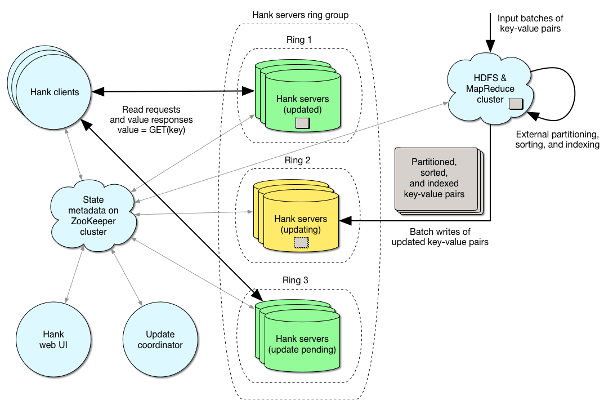
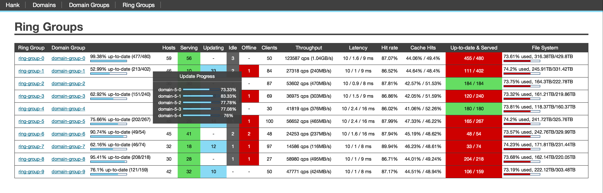

# Project Hank

[](https://travis-ci.org/LiveRamp/hank)

## Design

Hank is a very fast and very compact distributed key-value NoSQL database that we built and use at [LiveRamp](http://www.liveramp.com). Read queries are guaranteed to execute fewer than 2 disk seeks at all times, and to perform 1 network call on average. All disk write operations are strictly sequential to achieve high throughput updates (millions per second per node). Block compression of values, and an on-disk flyweight pattern provide compactness. Hank is fully distributed and fault tolerant. Data is consistently hashed and re-allocated automatically. It horizontally scales to terabyte and petabyte-sized datasets with billions or trillions of records. Range queries and random writes are not supported by design, for simplicity and performance.

Hank provides linear scalability, a no single point of failure design, strives for compact on-disk and over-the-network representations, as well as for consistent performance in constrained environments such as very high data-to-RAM ratios (1000:1 and more) and low remaining disk space. Hank was inspired by Amazon’s DynamoDB and shares a few design characteristics with LinkedIn’s Voldemort.

Hank leverages [ZooKeeper](http://zookeeper.apache.org) for coordination, metadata management, monitoring and notifications, [Hadoop](http://hadoop.apache.org) for external parallel indexing and intermediate data storage, [Thrift](http://thrift.apache.org) for cross-language client-server services, and MapReduce/[Cascading](http://www.cascading.org) to interface with user code and load data.

When it comes to the CAP theorem, Hank provides A (Availability) and P (Partitioning) but only eventual Consistency.

## Performance

Performance is very dependent on hardware, and I/O and CPU overheads are kept to a strict minimum. Hank performs either one or two disk seeks per request that does not hit the cache, no request will ever require three disk seeks. Therefore random read request latency will be bounded by the time it takes to perform two disk seeks on the drives, which is usually around a couple of milliseconds with an empty cache on modern spinning disks, sometimes much less. Random read throughput can easily hit tens of thousands of requests per second per node.

Incremental batch write throughput is also limited by hardware, more specifically by how much data the installation can stream over the network and write to disk (strictly sequentially, random writes are entirely avoided), which is probably around a couple hundreds of megabytes per second per node which, depending on the size of the values used, can translate to millions or hundreds of millions of key-values pairs written per second per node.

Additionally, Hank is not very chatty. Random read requests perform only one call over the network and communicate directly with a server that holds the requested key. There is no need for synchronization, no master node, no back-and-forth, and no agreement protocol at query time.

# Why we built Hank

We started building Hank in 2010, taking inspiration from design decisions of projects such as Amazon’s DynamoDB and LinkedIn’s Voldemort. We felt that our use case was specific enough to start experimenting and optimizing for it. The Hank project is the result of those efforts and has been very successful internally, achieving high-performance random reads, massive batch writes, with more than 99.9% availability during its first year in our production environment. Hank is used for all of LiveRamp’s random access needs when it comes to large datasets.

# Authors

The authors of Hank are [Thomas Kielbus](https://github.com/thomas-kielbus) and [Bryan Duxbury](https://github.com/bryanduxbury).

# Distribution

Some tips helpful when configuring domains can be found [here](https://docs.google.com/spreadsheet/ccc?key=0AvnnKDkRGJGodHM5TVk5eXdHMFIzcEJ4cDJWZTJadEE).

You can either build Hank from source as described below, or pull the latest jar from the LiveRamp Maven repository:

```xml
<repository>
  <id>repository.liveramp.com</id>
  <name>liveramp-repositories</name>
  <url>http://repository.liveramp.com/artifactory/liveramp-repositories</url>
</repository>
```

The 1.0-SNAPSHOT build can be retrieved there:

```xml
<dependency>
    <groupId>com.liveramp</groupId>
    <artifactId>hank</artifactId>
    <version>1.0-SNAPSHOT</version>
</dependency>
```

To build hank from source and generate the jar in target/:

```bash
> mvn package
```

To run the test suite locally:

```bash
> mvn test
```

# License

Copyright 2014 LiveRamp

Licensed under the Apache License, Version 2.0

http://www.apache.org/licenses/LICENSE-2.0

# Key characteristics

## A distributed key-value NoSQL database



Hank is a schema-less key-value database. It is conceptually similar to a distributed hash map. Keys and values are simply unstructured byte arrays, and there is no query language. It is designed to run on clusters of commodity hardware. Key-value pairs are transparently partitioned across a configurable number of partitions and fully distributed and replicated across nodes for scalability and availability. Also, data is automatically redistributed upon detected node failure. Data distribution is based on [rendezvous hashing](http://en.wikipedia.org/wiki/Rendezvous_hashing), a technique similar to consistent hashing to minimize the cost of rebalancing data across the cluster.

As an API, Hank only supports random read requests (retrieving the value for a given key) and incremental batch writes updates (loading a large set of key-value pairs, overwriting previous values, and optionally clearing out old entries that have not been updated). Random writes of single key-value pairs are not supported by design, for performance and simplicity. If your use case requires performant random writes, Hank is not well suited to it.

The typical architecture layout involves dedicated Hank nodes which run a server process, maintain indexed key-value pairs on disk, and maintain a partial index and often-queried entries in main memory cache. Those Hank servers respond to read requests (from clients), and batch write update requests (from the system coordinator process).

Indexing is meant to be performed externally, in the sense that source data is maintained and indexed by other nodes (typically a Hadoop cluster) before being streamed to the actual Hank servers to be persisted. This setup provides good flexibility and great scalability. Also, separating the intensive indexing workload from servers that are answering time-sensitive random read requests results in more predictable performance from the point of view of clients.

Clients interact directly with Hank servers when performing read requests (there is no master node). All required metadata (such as location of key-value pairs, available nodes, etc) is stored in the ZooKeeper cluster, and the provided Hank smart client is able to perform load balancing across servers and replicas, query retries, record caching, strictly locally, without having to communicate with any other node besides the Hank node from which the key-value pair is retrieved and the client’s ZooKeeper touch-point. Hank servers are built as a Thrift service, which means that they can be accessed directly from a variety of languages.

## Very low latency random read requests

As stated earlier, Hank is optimized for satisfying read requests (retrieving the value corresponding to a random key) with very low latency. Domains (tables) use configurable storage engines that specify the on-disk and in-memory representation of key-value pairs and strategies for reading and writing them.

Two storage engines are provided with Hank, one designed for variable-length values (which guarantees that read requests will perform only exactly two disk seeks on cache miss), and one designed for fixed-length values (which guarantees read requests in exactly one disk seek on cache miss). No request will ever require three disk seeks. This is achieved by proactively indexing data externally, maintaining a partial index in main memory, and (in the case of variable-length values), a full index on disk. Depending on your hardware, this results in random read request latency on the order of a few milliseconds to sub-millisecond.

## Caching


Hank is meant to be fast regardless of cache state, but it employs a few caching mechanisms to further speed up random read requests, as well as a simple load balancing hint to improve cache performance. The performance improvement obviously depends on access patterns, but we have seen production applications with a 20% client-side cache hit rate and a 50% server-side cache hit rate, resulting in a large percentage of read queries being fulfilled in much less than 0.1 milliseconds.

### Server-side OS-level cache

Hank servers benefit very heavily from OS-level disk cache and are an example of one of those applications where the OS-provided caching resources and algorithms will outperform most application-level approaches. Because indices and values are stored in flat files on disk at specific offsets, requesting the same key-value pair twice will hit your OS-level disk page cache and be retrieved instantly. (Because read and writes do not happen concurrently on any given Hank node, cached pages do not need to get invalidated.) For this reason, a server-side application cache is not necessary, as the OS-level cache can already transparently allocate all of the node’s remaining main memory to the Hank query cache, and is very performant.

### Server-side application-level cache

There is only one instance in which Hank does not fully rely on OS-level disk cache and performs its own application-level server-side caching: when it comes to domain tables that use block compression (values are grouped in large blocks and compressed and written to disk, see below). In this case the CPU overhead of decompressing a block can be non-trivial, therefore caching the compressed block by relying on the OS cache is not sufficient. Rather than caching the whole decompressed block in main memory (which would cache many unrelated key-value pairs, since keys are distributed randomly), Hank chooses to cache the individual key-value pair that was requested. Note that this approach is not perfect in the sense that a given key-value pair could be cached twice in main memory (raw in the application, and as part of a compressed block cached by the disk), but it works well in practice given that both cached objects can be useful in their own right (a request for a different key in the same compressed block would hit the disk cache and suffer only the decompression overhead, saving a disk seek).

### Client-side optimistic cache load balancing logic

Hank clients load balance their read requests across servers and replicas in a way designed to optimize server-side cache performance (both the OS-level and application-level cache). We call this optimistic query cache load balancing.
Essentially, for a given key, all clients can compute a random but deterministic value used to order the list of replicas used to query that key. This ensures that all clients can agree (without coordination) on the order in which specific nodes are going to be contacted to retrieve the value for a given key, while at the same time still distributing the overall load evenly across nodes. This significantly improves server-side cache performance if multiple independent clients are likely to query the same key over time since the first replica they’ll contact will be the one most likely to have the requested key-value pair in its cache.

### Client-side cache

In addition to server-side cache, Hank clients can optionally maintain their own in-memory cache of key-value pairs for even faster retrieval (no need to go over the network or to another server). This client-side cache is both time aware (key-value pairs expire and can use versioning information from ZooKeeper to maintain consistency) and size aware (the amount of main memory used is bound and configurable).

## Very high throughput incremental batch writes

Beyond low latency random read requests, Hank is optimized for very high throughput incremental batch writes (such as billions or trillions of records written per update). All key-value pairs are distributed across a number of independent partitions. Partitions are versioned, and new data is written to Hank servers by merging in a new (optionally partial) version of the dataset with the current key-value pairs (new delta), or by replacing them entirely, wiping out old non-updated entries (new base).
Random writes (updating the value for a given key) are not supported by design, for simplicity and performance, since many performance shortcuts can be taken when making the assumption that random writes are not a possibility. Hank is only eventually consistent, in the sense that large batch write updates are long running, and affect a subset of replicas at a time, which means that two clients could see two inconsistent values for the same key at any given time during the update process (consistency is maintained when no updates are running, of course). This is another major assumption and tradeoff that opens up the door to optimization.

As stated earlier, indexing is meant to be performed externally, typically on a separate Hadoop cluster. MapReduce and Cascading APIs are provided to build new domain partition versions (either delta or base) from any data set of key-value pairs that can be extracted from an HDFS file or a Cascading pipe.
Sorting and indexing is performed by a single MapReduce job. For even better performance, and if the input dataset is already partitioned and sorted in a meaningful way (as it often happens within a Hadoop cluster), it can be performed as a single Map-only operation, skipping the expensive over-the-network shuffling and reducing steps.

Once a new version has been built, sorted and indexed externally, the update process can stream it to the Hank servers themselves. Replicas are iteratively removed from the load balancer, updated, and then put back in the load balancer. Leveraging this external indexing and using a rolling update allows for great scalability and flexibility. Also, it separates these three very different workloads over time and across nodes so that clients reading off the Hank cluster are not adversely affected during massive batch write updates (not affected by either network traffic or disk writes).

The key to high performance of Hank key-value batch writes is the fact that absolutely all disk writes during an update are sequential (no random writes or disk seeking). Values are typically stored in flat files that are streamed from HDFS to the Hank server. Index files (from key to offset into that value file) that are produced externally are also streamed sequentially to the server. In the case of incremental (delta) updates, the two indices (the server’s current index, and the delta index) are merged on the server side. This is also a fast operation since both indices are fully sorted, and all is needed is merging them into a new index (again, a sequential operation on disk). Space used up by values of deleted/updated keys in the values files is unreachable and wasted, until compaction (see below).
Conceptually, values are stored in unordered large flat files, and a fully sorted index from hashed key to offset into that value file is maintained. The external indexing process produces sorted indices, so Hank servers only perform the merge operation of the merge-sort algorithm to obtain the new fully sorted index into the updated value files.

Again, performance of batch write updates completely depends on hardware and scales linearly with it. It is simply bounded by how fast key-value pairs can be streamed over from the external indexing nodes (e.g. HDFS) to the Hank server nodes, and how fast server nodes can write sequentially to disk (for value files), and read/merge sequentially on disk (for the much smaller index files). We have typically seen update speeds of hundreds of megabytes per second per node, which, depending on value size, translates into millions or hundreds of millions of key-value pairs written per second per node, without any degradation of read request latency from the point of view of clients (since reads and writes are separated).

## Consistent performance in constrained environments

Contrary to many systems, Hank is designed to be performant even in situations with a very high dataset size to RAM ratio. We have successfully used it with dataset size to RAM ratios of 1000:1 and more. The application cannot rely heavily on caching to provide fast reads or writes (write throughput is higher than what can be flushed from write cache to disk, and would overflow the cache, or read throughput is so high or so evenly distributed that cache hits are very rare.)

Also, Hank is designed to work well when remaining disk space on servers is low. There is no need for large temporary merging space when performing huge batch write updates, only a fixed space overhead is necessary throughout the updating process.

Data files are designed to be as compact as possible and store little metadata. The overall on-disk space overhead is around twenty bytes per key-value pair. Original keys are not even stored, so it is safe to use large keys if desired. Hashed keys are used to index data, Hank relies on collisions being so extremely rare given the hash function domain size to avoid having to deal with collision management. Additional techniques like identical value folding and block compression further reduce the data files size (see below).

Furthermore, read request latency performance is very predictable since, as mentioned earlier, the number of disks seeks is bound by two, and since reads and writes are fully separated (in the sense that nodes that are serving data are not updating, and vice-versa). The updating process takes nodes in and out of the load balancer. Read request latency tends to degrade when the updating nodes’ inbound network is saturated, or when their disks are under heavy write loads. We have decided to fully separate read requests from heavy batch writes to avoid that situation.

## Data format

### For fixed-length values


In the case of fixed-length values, data is stored in flat files of key-value pairs. There is one file per partition. The original keys are actually not preserved, and hashed keys are used. The entire file is sorted by those hashed keys. Furthermore, to save space, only suffixes of those hashed keys are persisted. Each block contains pairs of hashed key suffix and value. All pairs in a block share the same hashed key prefix. The file also contains a serialized partial index that maps each hashed key prefix to the file offset where that block is located. This partial index can be computed linearly when building the file.
For example, for 32-bit values, 80-bit key hashes, and a 16-bit key hash prefix, the key hash suffix would be 64 bits long (80 - 16), and each record on disk would be 96 bits long (64 + 32).

The index of hashed key prefix to block location is stored in main memory. At query time, the in-memory index is used to determine where on disk a given key would be, and only one disk seek is needed to access the correct block. The correct key-value record is found by linearly searching for the corresponding hashed key value suffix (in practice this rarely translates to more than one disk read, but it is a possibility).

Updating and adding values is performed by a merge pass of the merge-sort algorithm (since the update delta files have been sorted and indexed externally). This is an efficient operation as it only involves sequential operations (one full sequential read of both files, and one sequential write of the new file).

### For variable-length values


For variable-length values, each partition is composed of two files. An index file maps keys to disk offsets into a second file which is itself a flat file of contiguous values (each value is preceded by an integer header indicating its size). The index file simply uses the layout for fixed-length values that was described previously, in this case values are fixed-length disk offsets into the second file. Both files can be computed and written sequentially from a list of sorted key-value pairs.

The index file provides a serialized partial index into itself, as described previously, which is loaded into main memory. At query time, the in-memory partial index is used and a first disk seek is performed to that key’s block in the index file. With a linear scan, the disk offset (or location) of the actual value is found in the index file. With a second disk seek, and using the size header, the value is then loaded from disk.
For example, for 32-bit disk offsets, 80-bit key hashes, and a 16-bit key hash prefix, the key hash suffix would be 64 bits long (80 - 16), each index record on disk would be 96 bits long (64 + 32), and values would have an arbitrary size.

Updating and adding values is performed in two operations. First, the new value file is simply appended to the current value file, which is a sequential write. Next, a merge pass of the merge-sort algorithm is used to merge the new index with the current index file (as described previously for fixed-length values), which is also a linear sequential operation. Offsets to the new or updated values replace old offsets in the new index. Space taken up by now unreachable values is wasted until the next compaction, which is a process that writes a new “clean” value file by walking through the index file and checking which values are actually needed.
Note that after such an update, values might not be sorted by hashed key on disk anymore, but it does not affect performance.

### Identical value folding

Since sorting and indexing key-value pairs is performed ahead of time and externally, it is straightforward to perform a type of compression and cache optimization that we call value folding. With value folding, two different keys can share the exact same value on disk.

When writing values in a sorted order and building the index, a LRU-type cache is used to memorize where on disk recent values have been written. This cache maintains a mapping from hashed value to disk offset. When writing a value that has been seen recently, it is not written to the value file. Instead, the disk offset to the value written previously is re-used in the index. The efficiency of this technique obviously depends on how often values are duplicated and how large those are, but we have seen 20% reduction of value file size for some of our datasets. The cost of value folding is minimal when building data files (since it is CPU intensive and those tasks are usually IO-bound), and is a no-cost operation at runtime since it uses the same offset indirection technique. Furthermore value folding can actually improve read latency performance since it increases cache locality. Different requests for two different keys can hit the exact same location on disk and benefit from each other.

### Block compression

Hank gives the option to use block-level compression for both index files and value files. For data that compresses well, this typically gives much better compression ratios than single value-level compression.
When using block compression for value files, a configurable number of bits of the disk offset value represents the location of the block, and the rest represents the location of the value within that block (when decompressed).

## Linear scalability

Because of Hank’s design, performance and capacity scales horizontally and linearly with hardware. Capacity is exactly (cluster total disk space / replication factor), read throughput is (total random disk seek throughput / 2), average read latency is (average disk seek latency * 2), and batch write throughput scales with the total sequential write disk throughput available.

## No single point of failure design

There is no master node in Hank, and no node responsible for maintaining the mapping between keys and server nodes. Instead, all metadata is stored on a ZooKeeper cluster, and clients can rely the availability characteristics of that system to expect a no single point of failure behavior when performing queries.

The batch write update coordinator is the only process that has a special role. It reacts to data and configuration changes, as well as runtime information from the cluster to send commands to individual nodes notifying them to come online, go idle, update, etc. However, this a very shallow installation, it is a lightweight process and it does not maintain any data on local disk. It can be stopped and restarted instantly on a different node at any time without affecting clients reading from the Hank cluster.

## Web user interface and monitoring

Hank comes packaged with a nifty web-based UI and a configurable notifier. The UI allows users to:

- list and browse Hank clusters and corresponding data servers
- monitor cluster state: nodes online, offline, and updating
- monitor cluster usage: read throughput in requests per second and network throughput
- monitor cluster health: used and remaining disk space, cache hit rates, and histogram distribution of read request latency
- list clients connected to clusters
- list datasets, their sizes, the number of records in each version, and manually delete versions
- manually send commands to servers to go online, offline, and update

### All ring groups

### Ring group details

### Ring details

### Host partitions assignments

### Administration

### Domain group versioning

